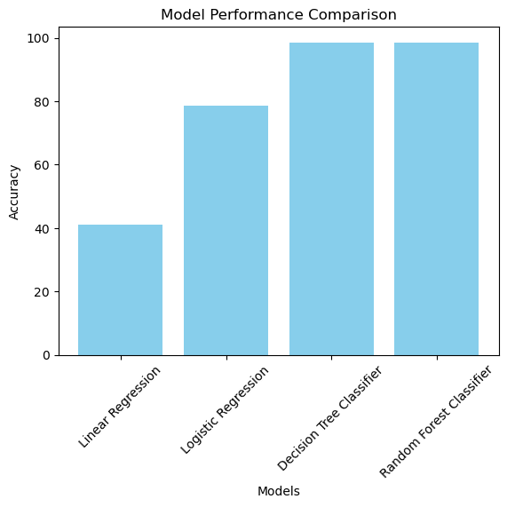
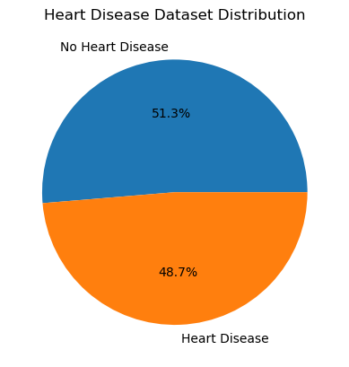
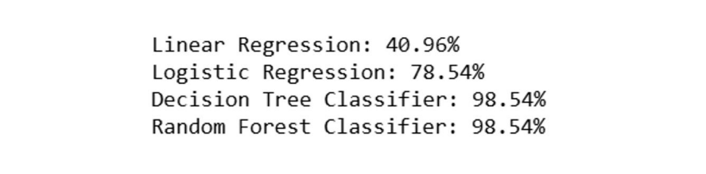

# Heart Disease Detection using Machine Learning

A group project for the course **Data Science for IoT (IT351)** at Qassim University, completed in **December 2024**.  
The goal was to develop a script that applies ML models to detect heart disease based on their health metrics.  
We used existing machine learning libraries to train and compare different models on a public dataset.

---

## 🧩 My Role

Although it was a team project, I was fully responsible for the **coding and technical part** of the project.

- I used **Python** and **Jupyter Notebook** to implement all parts of the code.
- I added and trained **four different models** using scikit-learn:
  - Decision Tree  
  - Random Forest  
  - Logistic Regression  
  - Linear Regression
- I compared their accuracy, visualized the results, and wrote the final version of the code.
- I also explained the implementation to the instructor and the rest of the team, since I had the most experience with Python and Jupyter.

---

## 📊 Models & Accuracy

| Model                | Accuracy   |
|---------------------|------------|
| Decision Tree        | 98.54%     |
| Random Forest        | 98.54%     |
| Logistic Regression  | 78.54%     |
| Linear Regression    | 40.96%     |

---

## 🛠️ Tools & Technologies

- Python
- Jupyter Notebook
- Scikit-learn
- Pandas
- Matplotlib

---

## 📂 Dataset

- 📌 Source: [Kaggle – Heart Disease Dataset](https://www.kaggle.com/datasets/johnsmith88/heart-disease-dataset)
- 🧪 Samples: 1,025
- 📈 Features: 14 health-related columns
- 🎯 Target: 0 = No disease, 1 = Has disease

---

## 📎 Based On

This project is based on an open-source notebook available at:

🔗 [Original Project on Kaggle](https://www.kaggle.com/code/syedali110/heart-disease-detection/notebook)

We extended the original code by testing multiple models, comparing results, and improving performance.

---

## 🖼️ Sample Output

### 🎯 Accuracy Comparison

### 📉 Heart Disease Dataset Distribution

### 🧾 Output Snapshot

---

## ▶️ How to Run

1. Open the Jupyter Notebook file `heart_disease_detection.ipynb`.
2. Run the notebook cells in order.
3. You will see the model training outputs, accuracy scores, and confusion matrices for each model.

---

## About the project
  
- **Project Date:** December 4, 2024  
- **Role:** Full code implementation, model comparison
